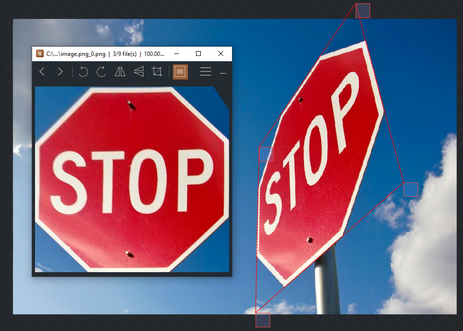

<h1 align="center">
  <picture></picture>
   
  TextureRipper
</h1>
<h3 align="center">
  
  
  
</h3>

  TextureRipper is a tool written in C# using WPF that allows you to select a plane of an image and fix the perspective to face the camera. The purpose of this tool is to rip textures from images that are otherwise unobtainable.

## Screenshots
  

## Usage

- **Drag/drop** or select an image to work with
- **Left click** to place/drag a point
- **Right click** to pan the image
- **Scroll** to zoom
- **Tab** to cycle the selected point
- **Arrow keys** or **WASD** to shift selected pixel
- **Shift + arrow keys** or WASD to shift selected quad
- **R** to rotate the output
- **P** to toggle live point order updating
