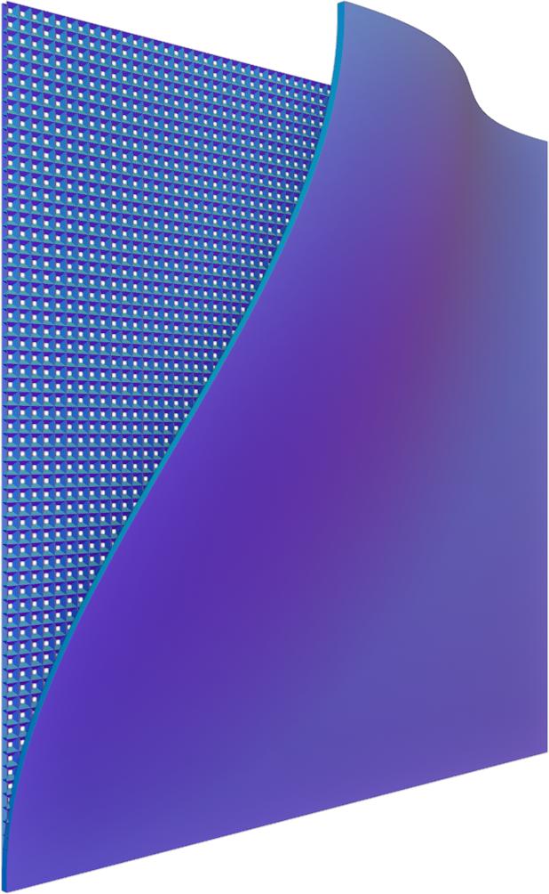

#  TextureRipper

TextureRipper is a tool written in C# using WPF that allows you to select a plane of an image and fix the perspective to face the camera. The purpose of this tool is to rip textures from images that are otherwise unobtainable.

## Features

- Select a plane in an image and define four corner points.
- Automatically correct the perspective of the selected plane to face the camera.
- Export the corrected image with the fixed perspective.
- User-friendly graphical user interface built with WPF.

## Screenshots

wip

## Getting Started

1. Drag/drop or select an image to work with
2. Left click to place points on the image
3. Right click to pan the image
4. Save button to output the result

## Usage

wip
